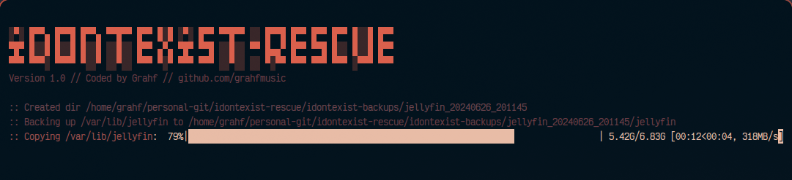

```markdown
# idontexist-rescue



**idontexist-rescue** is a Python script designed to facilitate backup and restore operations for my Jellyfin and automation applications. It automates the process of backing up application data to specified directories and supports restoring from previously created backups or compressed archives.

## Features

- **Backup Functionality**:
  - Supports backing up multiple Linux applications such as Jellyfin, Sonarr, Lidarr, Radarr, Jellyseerr, Jackett, and Nginx.
  - Creates timestamped backups of specified directories associated with each application.
  - Optionally compresses backups into `tar.xz` archives for efficient storage.

- **Restore Functionality**:
  - Allows restoring from uncompressed backup directories or `tar.xz` archives.
  - Restores application data to their respective directories (`/var/lib/<app_name>`).

- **Terminal User Interface**:
  - Displays colorful ASCII art header using the `art` library upon script execution.
  - Provides real-time progress updates during backup and restore operations using `tqdm`.

- **Command-Line Options**:
  - `--backup-dir`: Specify the directory where backups will be stored (default: `./idontexist-backups`).
  - `--tar`: Enable compression of backup directories into `tar.xz` archives after backup.
  - `--restore <path>`: Restore from a specified backup directory or `tar.xz` file.
  - `--app <name>`: Specify the application to backup or restore. Use 'all' to backup all supported applications.
  - `--verbose`: Enable verbose mode to display detailed progress and debug information.

## Installation

Ensure you have Python 3 installed along with pip. Clone the repository and install dependencies:

```bash
git clone https://github.com/grahfmusic/idontexist-rescue.git
cd idontexist-rescue
pip install -r requirements.txt
```

## Usage

Run the script with sudo privileges to access application data:

```bash
sudo python3 idontexist-rescue.py --app <app_name> --backup-dir /path/to/backup/dir --tar
```

### Example Usage

1. **Backup Sonarr**:

   ```bash
   sudo python3 idontexist-rescue.py --app sonarr --backup-dir /home/user/backups --tar
   ```

2. **Restore Nginx**:

   ```bash
   sudo python3 idontexist-rescue.py --restore /path/to/nginx_backup.tar.xz --app nginx
   ```

3. **Backup All Applications**:

   ```bash
   sudo python3 idontexist-rescue.py --app all --backup-dir /home/user/backups --tar
   ```

## Dependencies

- `art==5.2`
- `termcolor==1.1.0`
- `colorama==0.4.4`
- `tqdm==4.62.3`

## Contributing

Contributions are welcome! Please fork the repository and submit pull requests.

## License

This project is licensed under the MIT License - see the [LICENSE](LICENSE) file for details.

## Author

- **Grahf** - [GitHub](https://github.com/grahfmusic)

```
